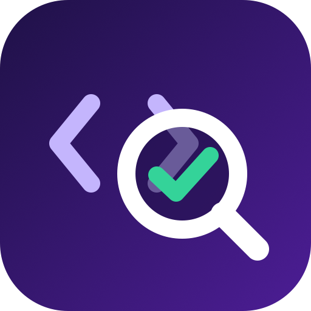

<p align="center"></p>

<h1 align="center">Codex PR Review</h1>

<p align="center">On-demand pull request reviews from <b>Codex's native reviewer</b>, on OpenAI models via the <b>OpenAI API</b> or <b>Amazon Bedrock</b>.</p>

Comment `@gpt review` on a pull request. About a minute later you get a review with a verdict, an issues table linking every finding to its exact lines, and inline comments on the diff. The review uses `codex exec review`, the same logic as `/review` in the Codex CLI, so you get OpenAI's own review behaviour rather than a hand-written prompt.

| `provider` | Auth | Billing | Default model |
|---|---|---|---|
| `openai` | `OPENAI_API_KEY` secret | OpenAI API | `gpt-6.1-sol` |
| `bedrock` | IAM role via GitHub OIDC, no stored keys | Your AWS account, at OpenAI's rates | `us.openai.gpt-6-sol` |

> This is an independent project, not an official OpenAI or AWS product.

## What a review looks like

> ## Codex review
>
> 🟠 **5 issues to address** (4 P1, 1 P2)
>
> The patch introduces five correctness issues, including incorrect discounts and non-integer monetary results.
>
> | | Priority | Issue | Location | |
> |---|---|---|---|---|
> | 🟠 | P1 | Convert percentage points to a fraction | `e2e/pricing.ts:16` | 💬 inline |
> | 🟠 | P1 | Round discounted totals to integer cents | `e2e/pricing.ts:16-17` | 💬 inline |
> | 🟠 | P1 | Handle zero units before calculating the average | `e2e/pricing.ts:22` | 💬 inline |
> | 🟠 | P1 | Round average unit prices to integer cents | `e2e/pricing.ts:22` | 💬 inline |
> | 🟡 | P2 | Sort ascending to select the cheapest item | `e2e/pricing.ts:26` | 💬 inline |
>
> <sub>Reviewed `314c52a` against `main` · `gpt-6.1-sol` via OpenAI API · medium effort · View run</sub><br>
> <sub>Re-run: `@gpt review` · deeper: `@gpt review high` · on Bedrock: `@gpt review bedrock`</sub>

- **Verdict first**: ✅ no issues, 🟡 minor issues, or 🟠/🔴 issues to address, with counts per priority.
- **Issues table**: every finding with its priority (P0 to P3) and a `file:lines` link pinned to the reviewed commit.
- **Inline comments** on the exact diff lines (including multi-line ranges); findings outside the diff appear as collapsible details, so nothing is lost.
- **Progress and failures on the PR**: a "🔍 in progress" note (with a link to the live run) is replaced by the review. If anything fails, it becomes "❌ failed" with the actual error. The requesting comment gets 👀, then 🚀 or 😕.
- **Re-reviews stay tidy**: earlier Codex comments are collapsed as outdated.
- **Next steps** under every review: how to re-run, go deeper, or switch provider.

## Quick start

1. Add an `OPENAI_API_KEY` Actions secret (or set up [Bedrock](#amazon-bedrock)).
2. Put this in `.github/workflows/codex-review.yml` on your default branch (comment-triggered workflows only run from there):

   ```yaml
   name: Codex PR Review

   on:
     issue_comment:
       types: [created]
     pull_request:
       types: [labeled]

   permissions: {}

   jobs:
     codex:
       permissions:
         contents: read
         pull-requests: write # post the review, react and reply
         issues: write # react to the requesting comment
         id-token: write # AWS OIDC, for the bedrock provider
       uses: piyush-gambhir/codex-pr-review/.github/workflows/review.yml@v1
       with:
         base-branches: main
       secrets: inherit
   ```

3. Comment on an open pull request:

   | Comment | Does |
   |---|---|
   | `@gpt review` | Review with the defaults |
   | `@gpt review high` | Deeper reasoning (`low`, `medium`, `high`, `xhigh`) |
   | `@gpt review bedrock` | Use Amazon Bedrock for this request |
   | `@gpt review bedrock xhigh` | Both |

Only open, same-repository PRs into `base-branches`, requested by someone with write access, are reviewed, one review at a time per PR. Nothing runs on open or push, so you only pay for reviews someone asks for.

[`examples/codex-review.yml`](examples/codex-review.yml) is this file with the manual trigger and the optional settings filled in. If you would rather see every step (or you are on GitHub Enterprise Server, where the reusable workflow does not work), copy [`examples/codex-review-standalone.yml`](examples/codex-review-standalone.yml) instead: same behaviour, all of it in your repository.

## Triggers

Three ways to ask for a review, all handled by the same gate:

| Trigger | How | Notes |
|---|---|---|
| Comment | `@gpt review [openai\|bedrock] [low\|medium\|high\|xhigh]` at the start of a PR comment | Options come from the first line; the comment gets 👀, then 🚀 or 😕 |
| Label | Add the `codex-review` label to the PR | The label is removed again, so re-adding it re-runs the review. Set `label: ""` to switch this off |
| Manual | Actions tab → the workflow → **Run workflow** → PR number | Add a `workflow_dispatch` input named `pr-number` and pass it through as `pr-number` |

Every trigger requires write access on the repository, an open pull request, a same-repository head branch (fork PRs are skipped, because the review job holds model credentials) and a base branch listed in `base-branches`. A PR into an unlisted base branch gets one short reply saying so; everything else is declined silently, and the workflow stays green.

## Reusable workflow inputs

Everything is optional. `base-branches` defaults to your repository's default branch.

| Input | Default | Description |
|---|---|---|
| `base-branches` | default branch | Comma-separated base branches that may be reviewed |
| `command` | `@gpt review` | Comment prefix that requests a review |
| `label` | `codex-review` | Label that requests a review; empty turns label triggers off |
| `remove-label` | `true` | Remove the label again, so it can be re-added to re-run |
| `default-provider` | `openai` | Provider when the request does not name one |
| `default-effort` | `medium` | Reasoning effort when the request does not name one |
| `allowed-providers` | `openai,bedrock` | Providers a request may choose |
| `pr-number` | | Pull request number for `workflow_dispatch` runs |
| `runs-on` | `ubuntu-24.04` | Runner label, or a JSON array such as `["self-hosted", "linux"]` |
| `model` | per provider | Model ID |
| `aws-region` | `us-east-1` | Bedrock region |
| `guidelines-path` | `.github/codex-review.md` | Guidelines file, read from your default branch; empty loads none |
| `max-priority` | `P3` | Lowest priority to report |
| `fail-on-priority` | | Fail the review when a finding at this priority or higher is reported |
| `app-id` | | GitHub App ID, to post under your own bot name and avatar |

Secrets (`secrets: inherit` passes whichever you have): `OPENAI_API_KEY`, `AWS_ROLE_TO_ASSUME`, `CODEX_REVIEW_APP_PRIVATE_KEY`, and `ACTION_REPO_TOKEN` only if you run a private copy of this repository.

### Just the trigger

To keep your own review job and only reuse the gate, use the trigger action on its own:

```yaml
- id: trigger
  uses: piyush-gambhir/codex-pr-review/trigger@v1
  with:
    base-branches: main
    label: codex-review
```

It outputs `run` (`true` or `false`), `pr-number`, `head-sha`, `base-ref` (already `origin/`-prefixed), `provider`, `effort`, `comment-id` and `reason` (why no review runs, e.g. `no-command`, `no-write-access`, `fork`, `base-branch-not-allowed`). It needs `pull-requests: write` and `issues: write` to react, reply and remove the label.

> **How the reusable workflow finds its own action.** `github.workflow_ref` and `github.workflow_sha` describe the *caller*, and `./` resolves against the caller's checkout, so neither can name the action version that belongs with the workflow. Each job instead checks out `job.workflow_repository` at `job.workflow_sha` (the workflow file defining the running job, which is this workflow) and uses the action from that checkout. So `@v1.1.0` of the workflow runs v1.1.0 of the action, a full-SHA pin runs that SHA, and a private copy of this repository uses itself. The trade-off: [`job.workflow_*`](https://docs.github.com/en/actions/reference/workflows-and-actions/contexts#job-context) does not exist on GitHub Enterprise Server, so use the standalone example there.

## Customising

### Repository guidelines

Put review rules in `.github/codex-review.md` on your default branch (or point `guidelines-path` elsewhere). The workflow loads that file from the default branch (never from the PR, so a PR can't rewrite the rules it's reviewed against) and passes it to Codex. Codex applies it on top of its own review logic. See [`examples/codex-review.md`](examples/codex-review.md).

Guidelines are good for:

- **Severity**: "any query not scoped to the caller's tenant is P0".
- **Conventions**: "money is stored as integer cents".
- **Exclusions**: "ignore generated code under `src/gen/`".

You can also pass rules inline with `review-instructions`.

### Filtering and gating

- `max-priority: P1` reports only P0 and P1 findings; the number hidden is noted under the review.
- `fail-on-priority: P1` fails the step when a P0 or P1 finding is reported. Make the check required if it should block merging. The review is still posted.

### Output

- `post-mode: review` (default): verdict and issues table in the review body, plus inline comments.
- `post-mode: comment`: one comment with the table and collapsible details.
- `post-mode: none`: nothing posted; use the outputs and the job summary.

Every run also writes the review to the workflow's job summary.

### Your own bot name and avatar

By default reviews are posted by `github-actions`. To post under your own name and icon, use a GitHub App:

1. Create a GitHub App (Settings → Developer settings → GitHub Apps → New). Name it what you want the bot to be called, for example `Acme Code Review`. Disable the webhook. Repository permissions: **Pull requests: read and write**, **Issues: read and write**.
2. Upload a logo. [`assets/icon.png`](assets/icon.png) is free to use, or bring your own.
3. Install the app on your repository, and generate a private key.
4. Add the repository variable `CODEX_REVIEW_APP_ID` (the app ID) and the secret `CODEX_REVIEW_APP_PRIVATE_KEY` (the `.pem` contents).
5. Pass the ID to the reusable workflow: `with: { app-id: "${{ vars.CODEX_REVIEW_APP_ID }}" }`.

The workflow mints an app token with `actions/create-github-app-token` and passes it as `github-token`. Reviews then appear as `your-app-name[bot]` with your logo. Please don't use OpenAI's or Codex's name or logo for your app, so readers don't mistake it for an official product.

## Amazon Bedrock

1. Enable the OpenAI model in Amazon Bedrock (for example GPT-6 Sol in `us-east-1`).
2. Add GitHub as an IAM OIDC identity provider: `https://token.actions.githubusercontent.com`, audience `sts.amazonaws.com`.
3. Create an IAM role trusted only for `repo:OWNER/REPO:ref:refs/heads/<default branch>` (comment-triggered workflows always run from the default branch), with:

   ```json
   {
     "Version": "2012-10-17",
     "Statement": [
       {
         "Effect": "Allow",
         "Action": ["bedrock:InvokeModel", "bedrock:InvokeModelWithResponseStream", "bedrock:GetInferenceProfile"],
         "Resource": [
           "arn:aws:bedrock:us-east-1:ACCOUNT_ID:inference-profile/us.openai.gpt-6-sol",
           "arn:aws:bedrock:*::foundation-model/openai.gpt-6-sol*"
         ]
       },
       { "Effect": "Allow", "Action": "bedrock:ListInferenceProfiles", "Resource": "*" }
     ]
   }
   ```

4. Add the role ARN as the Actions secret `AWS_ROLE_TO_ASSUME`, then comment `@gpt review bedrock`.

## Inputs

| Input | Default | Description |
|---|---|---|
| **Model** | | |
| `provider` | `openai` | `openai` or `bedrock` |
| `model` | per provider | `gpt-6.1-sol` (openai) or `us.openai.gpt-6-sol` (bedrock) |
| `reasoning-effort` | `medium` | `low`, `medium`, `high`, `xhigh` |
| `openai-api-key` | | Required for `openai` |
| `aws-role-to-assume` | | Required for `bedrock` |
| `aws-region` | `us-east-1` | Bedrock region |
| `bedrock-endpoint` | `amazon-bedrock-runtime` | `amazon-bedrock` for Mantle (in-region IDs such as `openai.gpt-6-sol`; needs `bedrock-mantle:CreateInference`) |
| **What to review** | | |
| `base-ref` | required | Ref to diff against, e.g. `origin/main`; check out with `fetch-depth: 0` |
| `pr-number` | required | Pull request to post on |
| `head-sha` | required | Commit the review is anchored to |
| `working-directory` | `.` | Where the PR is checked out |
| **Review behaviour** | | |
| `review-instructions` | | Inline review guidelines |
| `review-instructions-file` | | Guidelines file, relative to the workspace |
| `max-priority` | `P3` | Lowest priority to report |
| `fail-on-priority` | | Fail the step when a finding at this priority or higher is reported |
| **Output** | | |
| `post-mode` | `review` | `review`, `comment` or `none` |
| `hide-previous` | `true` | Collapse earlier Codex comments as outdated |
| `status-comment` | `true` | Progress note while reviewing; becomes a failure note on errors |
| `trigger-comment-id` | | Requesting comment; gets 🚀 on success and 😕 on failure |
| `rerun-hint` | | Next-steps line under the review |
| `title` | `Codex review` | Review heading |
| `github-token` | `github.token` | Needs `pull-requests: write`; use an app token for a custom bot identity |
| **Advanced** | | |
| `sandbox` | `read-only` | Codex sandbox for commands it runs while reviewing |
| `codex-config` | | Extra raw TOML for Codex's `config.toml` |
| `codex-version` | `0.159.1` | Pinned Codex CLI version |

## Outputs

| Output | Description |
|---|---|
| `findings-count` | Findings reported (after `max-priority`) |
| `highest-priority` | e.g. `P1`; empty when clean |
| `filtered-count` | Findings hidden by `max-priority` |
| `findings-file` | JSON file: `priority`, `title`, `path`, `start`, `end`, `body` per finding |
| `review-file` | Codex's raw review message |

## Models and prices

| Model | Provider | Per 1M tokens (input / cached / output) |
|---|---|---|
| `gpt-6.1-sol` | openai | $2.00 / $0.10 / $10.00 |
| `gpt-6-sol`, `us.openai.gpt-6-sol` | openai, bedrock | $2.00 / $0.20 / $10.00 |
| `gpt-6-astra`, `us.openai.gpt-6-astra` | openai, bedrock | $10.00 / $1.00 / $50.00 |
| `gpt-6-luna`, `us.openai.gpt-6-luna` | openai, bedrock | $0.10 / $0.01 / $0.50 |

Standard OpenAI API rates, which Bedrock matches. Input above 272K tokens is billed at the long-context rate. Codex's review mode doesn't currently report token usage, so check OpenAI or AWS billing for actual cost.

## How it works

1. **Progress note**: posted on the PR with a link to the run.
2. **Install**: the pinned Codex CLI goes into `RUNNER_TEMP` with npm install scripts disabled.
3. **Credentials**: for `bedrock`, `aws-actions/configure-aws-credentials` assumes the role via OIDC and returns credentials as step outputs. For `openai`, the key is passed as `CODEX_API_KEY`. Only the review step receives them, and no GitHub token reaches Codex.
4. **Config**: [`scripts/write_config.py`](scripts/write_config.py) writes Codex's `config.toml`: provider, model, effort, a read-only sandbox, no approvals, your guidelines, and a minimal environment (`shell_environment_policy.inherit = "core"`) so commands Codex runs never see the credentials.
5. **Review**: `codex exec review --base <base-ref>` reviews the diff against the merge base.
6. **Publish**: [`scripts/publish_review.py`](scripts/publish_review.py) parses the findings and posts the review. If GitHub rejects an inline anchor, everything goes in the body instead. [`scripts/status.py`](scripts/status.py) then clears the progress note, or turns it into a failure note. A failed or empty review never looks like a pass.

## Security

- **Trusted contributors only.** The review job holds model credentials and checks out PR code. It never builds or runs that code, but Codex may run read-only commands in its sandbox while reviewing. The trigger skips fork PRs and requires write access.
- **Don't use `pull_request_target`** with this action.
- **Load guidelines from the default branch**, as the workflow does.
- **Pin the action** to a tag or commit SHA.

## Development

```bash
python3 -m unittest discover -s tests -v
```

The tests cover:

- parsing real Codex output, including layouts nudged by custom guidelines
- the trigger: option parsing, every event, access, forks, base branches, label removal
- filtering, gating and rendering
- status notes
- config generation

## License

[MIT](LICENSE)
